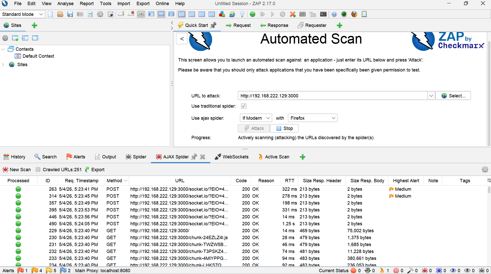
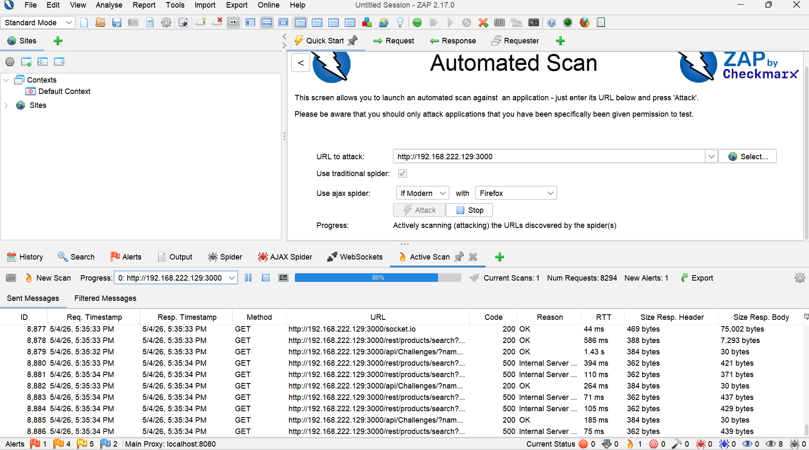
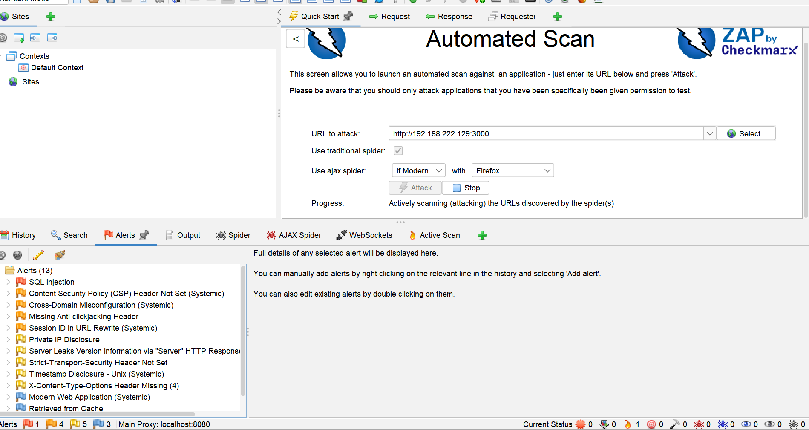
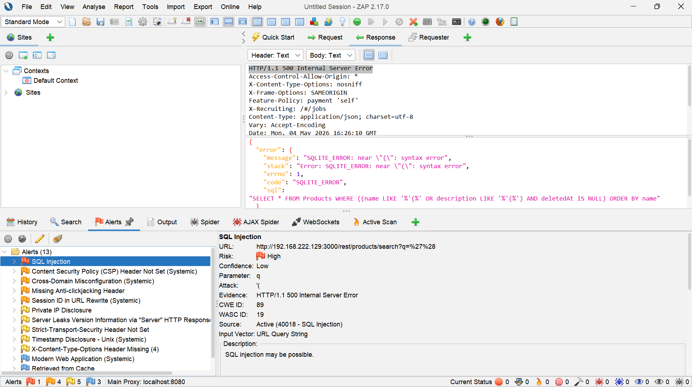
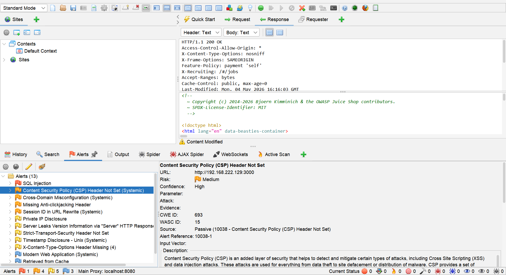

# Web Application Security Testing (OWASP ZAP)

## Objective
To identify security vulnerabilities in a web application using automated scanning techniques with OWASP ZAP.

## Scope
- Target: http://192.168.222.129:3000 (OWASP Juice Shop)
- Environment: Local lab (Docker on Kali Linux)

### Tools Used
- OWASP ZAP (Web Application Security Scanner)  
- Kali Linux (Penetration Testing OS)  
- OWASP Juice Shop (Intentionally Vulnerable Web App)  
- Firefox Browser (Proxy Configuration)  

## Methodology

The assessment followed a structured approach:

1. Target discovery  
2. Spidering (application crawling)  
3. Active vulnerability scanning  
4. Analysis of identified issues  

##  Target Setup

The target application was hosted locally and accessed via its internal network IP address.

### Spidering Phase

Purpose:
The application was crawled to identify accessible pages and endpoints.

##  Active Scan

Purpose:
An automated active scan was performed to test input vectors and application responses for common vulnerabilities including XSS, SQL injection, insecure configurations, and information disclosure

### Output

##  Alerts & Vulnerability Analysis

Purpose:
To review and analyze vulnerabilities detected during the scan.

### Output

### Example Vulnerability: SQL Injection & Cross-Site Scripting (XSS) 

Purpose:
A potential Cross-Site Scripting (XSS) vulnerability was identified, which could allow attackers to execute malicious scripts in a victim’s browser

## Findings

- Several application endpoints and API routes were discovered during crawling  
- Input fields were found to be insufficiently sanitized  
- Automated scanning detected multiple medium and low severity vulnerabilities
  
The assessment was aligned with the OWASP Top 10, including:

- Injection flaws (SQLi, XSS)  
- Security misconfiguration  
- Broken access control  
- Sensitive data exposure
  

## Risk Analysis

Identified vulnerabilities could allow attackers to:
- Execute malicious scripts  
- Access sensitive information  
- Exploit misconfigurations  

## Mitigation

- Implement input validation and sanitization  
- Configure proper security headers  
- Regularly test and patch vulnerabilities  
- Follow secure coding practices  

## Conclusion

This lab demonstrates how automated tools like OWASP ZAP can effectively identify vulnerabilities in web applications. Regular testing is essential for maintaining application security.

## ⚠️ Disclaimer

This testing was conducted in a controlled lab environment using intentionally vulnerable applications (OWASP Juice Shop). No production systems were tested.
